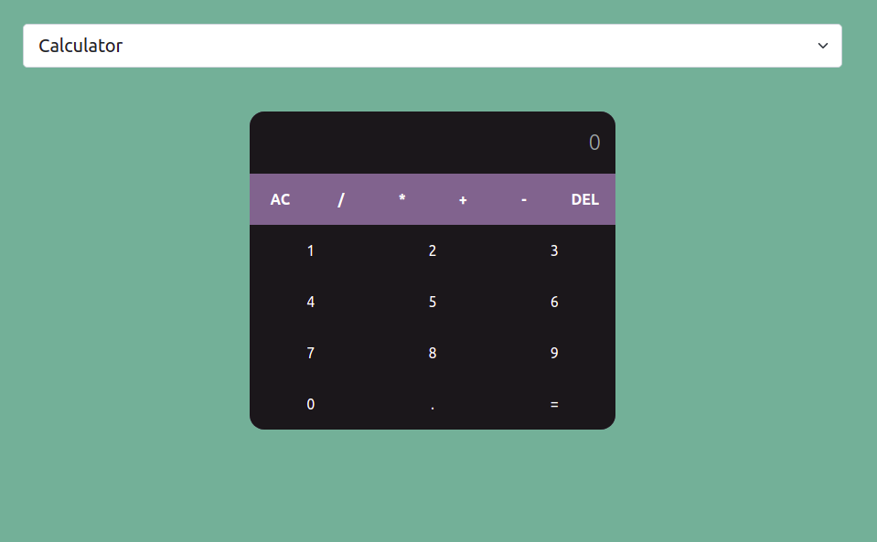
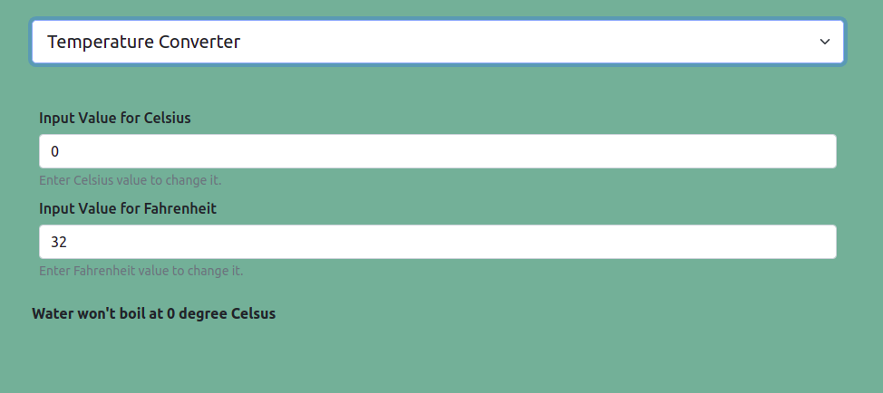

# Here are two calculators
## 1. Numeric calculator
### You can ADD, SUBTRACT, MULTIPLY, DIVIDE different numbers

 

## 2. Temperature calculator
### You can convert Celsius to Fahrenheit and vice versa

 